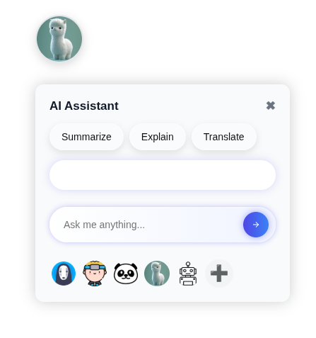

# AI_Chrome_Extension

A simple and lightweight AI assistant that lives in your browser.
Highlight any text on a webpage and instantly get it summarized, explained, or translated — right from a floating chat head.
Built using JavaScript and Gemini 2.0 API.

---



## 🚀 How to Use

### 1. Clone the Repo

```bash
git clone https://github.com/khalidhasananik/AI_Chrome_Extension.git
```

### 2. Navigate into the Project Folder

```bash
cd ai-chrome-extension
```

### 3. Open the Folder in VS Code

```bash
code .
```

### 4. Add Your Gemini API Key

Create a new file named `config.js`:

```bash
touch config.js
```

Paste the following code into it:

```js
const CONFIG = {
    GEMINI_API_KEY: "YOUR_GEMINI_API_KEY"
};
```

> You can get a free API key from [Google AI Studio](https://makersuite.google.com/).

---

### 5. Load the Extension in Chrome

1. Open `chrome://extensions`
2. Enable **Developer mode** (top-right)
3. Click **Load unpacked**
4. Select the project folder you just cloned

---

### 6. Use the Assistant

- Go to any webpage
- A floating chat head should appear at the bottom-right
- Click it to open the assistant UI
- Highlight any text → get AI magic

---

Made for fun, learning, and experimenting with AI in the browser!

Feel free to fork, tweak, or improve 🚀

---

MIT License  |  Built with ❤️ by Khalid Hasan
